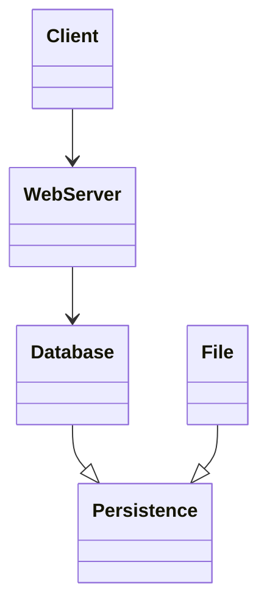

<<<<<<< HEAD
[Motif Software](Website Motif) #product
=======
[[Website Motif|Motif Software]] #product
>>>>>>> cdc2024 (Export)

### An ontology of the elements of software

Metal is so named because the set of concepts is intended to be simple and solid but varied. Software designed using the concepts of Metal are considered “Metallic”.

#metal: Notes about concepts.

### Education

Metal serves as an encyclopedia of the elements of software. It could provide a foundation for learning about software systems and development.